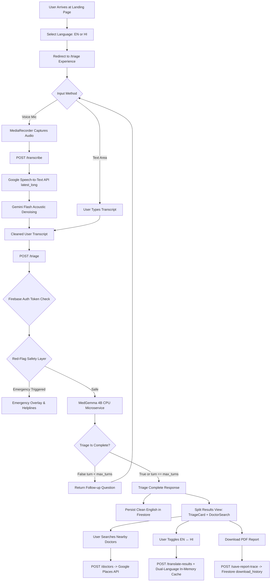

# CarePathAI — System Architecture

CarePathAI uses a decoupled, serverless microservice architecture deployed on Google Cloud Platform (GCP). It isolates user interaction, audio transcription, clinical reasoning, location services, and data persistence into specialized layers.

---

## 1. End-to-End System Flow Diagram



---

## 2. Component Architecture & Design Rationales

| Component | Technology | Responsibilities | Design Rationale |
|---|---|---|---|
| **Frontend Web App** | React 19, Vite, Tailwind CSS v4, Zustand | SPA routing (`/`, `/triage`), state management, mic audio capture, dual-language cache, PDF report printing | Client-side rendering guarantees sub-second UI switches and zero page reloads during multi-turn triage. |
| **API Gateway & Orchestrator** | FastAPI, Uvicorn, Python 3.11 | Exposes REST endpoints, validates schemas via Pydantic, executes red flags, manages Firestore sessions | FastAPI provides asynchronous request handling and native openapi docs. |
| **Clinical AI Engine** | MedGemma 4B GGUF (`Q5_K_M`), `llama-cpp-python`, FastAPI | CPU-based medical triage inference, structured JSON output generation | Microservice architecture decouples LLM loading from the main API web server, keeping RAM budgets isolated. |
| **STT & Denoising Engine** | Google Speech-to-Text API, Gemini 2.5 Flash | Acoustic speech decoding (`latest_long`) and phonetic artifact correction | Dual-pass STT + LLM denoising fixes misrecognitions like "climbing D stears" to "climbing the stairs". |
| **Provider Search** | Google Places Nearby Search & Place Details API | Fetches top-rated doctors, exact addresses, phone numbers, and Google Maps directions URLs | Direct Google Places integration ensures up-to-date, real-world doctor data without stale database records. |
| **Data Persistence & Cache** | Google Cloud Firestore | Session history storage, translation cache (`translation_cache`), report download trace audit | Document-based Firestore provides flexible schema persistence and native server-side timestamping. |

---

## 3. Data Flow & Security Principles

```
+------------------------------------------------------------------------------------+
|                                    SECURITY BOUNDARY                               |
|                                                                                    |
|  [User Browser]                                                                    |
|        |                                                                           |
|        +--- (HTTPS + Bearer ID Token) ---> [FastAPI Cloud Run Backend]            |
|                                                      |                             |
|                                                      +---> GCP Secret Manager      |
|                                                      |     (Fetches PLACES_API_KEY)|
|                                                      |                             |
|                                                      +---> MedGemma Cloud Run      |
|                                                      |     (Private Cloud Run)     |
|                                                      |                             |
|                                                      +---> Firestore DB            |
|                                                            (Session Storage)       |
+------------------------------------------------------------------------------------+
```

1. **Clean English Grounding in Persistence**: Even when patients converse in Hindi, Firestore records are stored strictly in English (`session_state` and `triage_result`). Translations are performed on-demand or returned dynamically, preserving clinical accuracy for healthcare providers.
2. **Dual-Language In-Memory & Firestore Caching**: Translated string pairs are cached in Firestore (`translation_cache`) and in the frontend Zustand store (`triageResultCache: { en: ..., hi: ... }`), preventing redundant API calls and latency.
3. **Short-Circuit Emergency Override**: Hardcoded pattern matching evaluates user inputs for critical red flags (chest pain, severe breathlessness) prior to querying the LLM, ensuring zero AI hallucination risk for life-threatening emergencies.

